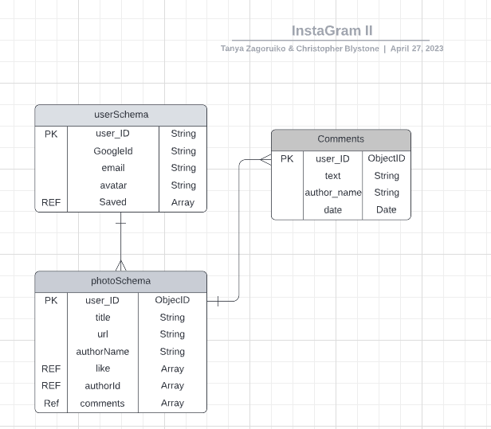
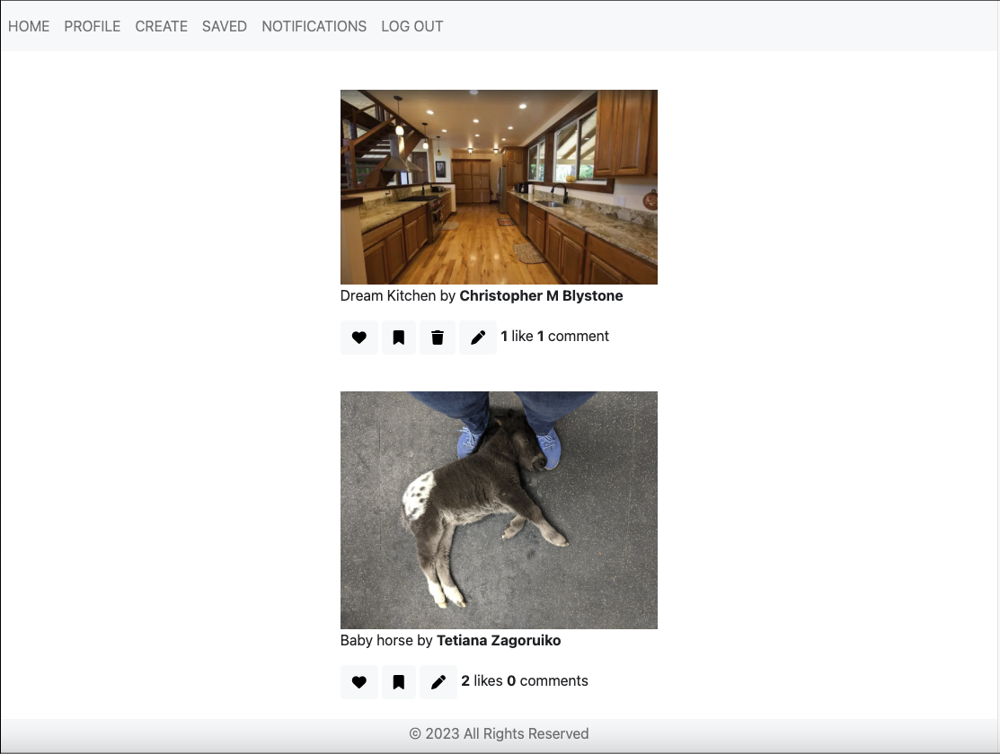
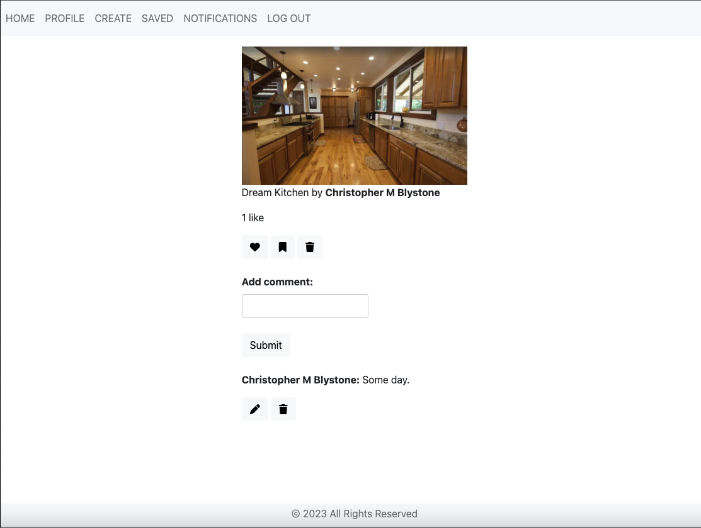

# INSTAGRAM CLONE
# Project Description:
The creation of an InstaGram like program where a user is able to see the home page that shows several different photos which include the title of those photos, the authors of those photos, how many likes and how many comments have been made. The user then being allowed after authentication to navigate through the program using the functions available to see their profile page, create page, saved page, notifications page, while also being able to log out.  

* Users can login with Google account.

* After logging in they will be presented to their home page.

* Users will then be able to comment or like on photos while also being able to add and delete photos.

* Give the user the ability to save or delete photos from their saved page.

* Give the user the ability to navigate to the notification page to see who has commented on their photos and/or liked their photos.

* Users on their profile page be able to change their name or avatar to meet their needs.

* Users can add, edit, or delete any comments that they have added to a posted photo.

* Users can log out and be redirected to the home page.

# InstaGram Clone Schema Diagram

# Image of Home Page

# Image of Example Page

# Technologies Used:
 * JavaScript
 * Node.js
 * Express
 * MongoDB, Mongoose
 * EJS
 * Google OAuth & Authorization
 * HTML
 * CSS
 * Bootstrap

 
# Instagram Clone Link
https://gentle-ravine-13392.herokuapp.com/

# Next Steps:
* Upload videos
* Download Videos and Photos from a user's device
* Add hashtags and locations
